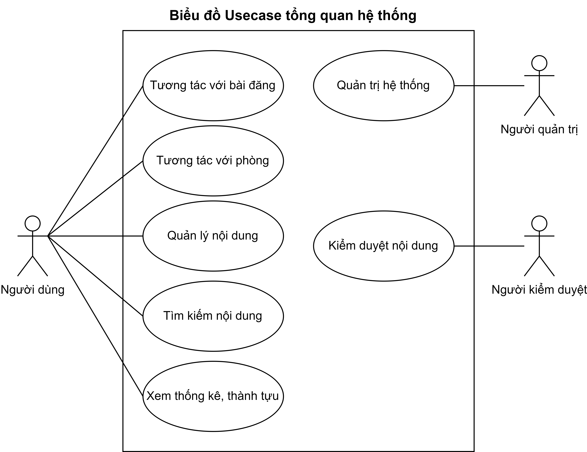

# Tổng quan
Dự án xây dựng hệ thống hỗ trợ thi trắc nghiệm và chấm điểm tự động

# Các tác nhân của hệ thống:
- Người dùng: Sử dụng hệ thống để khám phá ngân hàng câu hỏi và đề thi cũng như tự rèn luyện kiến thức của bản thân.
- Người kiểm duyệt: Sử dụng hệ thống để kiểm duyệt chất lượng đề thi và xử lý các báo cáo.
- Administrator: Sử dụng hệ thống để quản lý toàn bộ nội dung trên hệ thống.

# Các Usecase của hệ thống:

